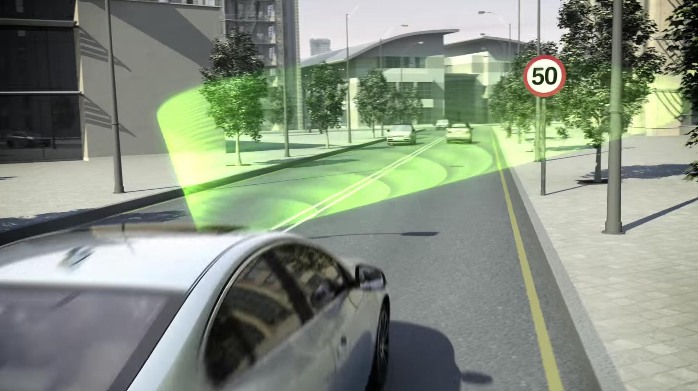
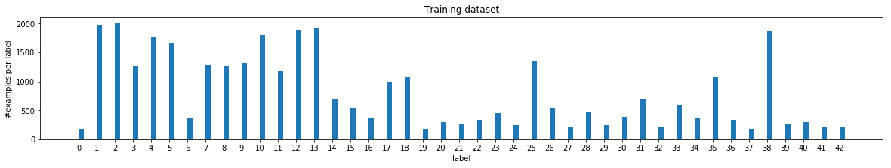
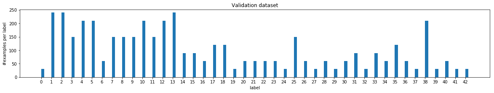
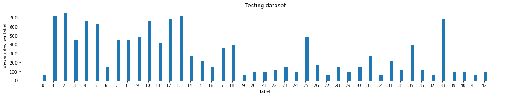
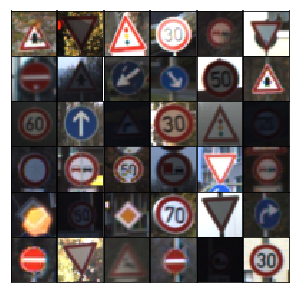
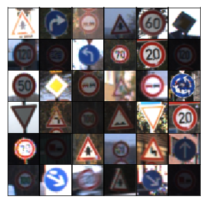
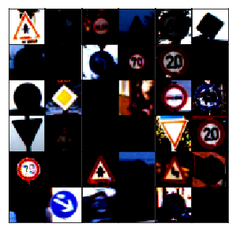
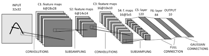
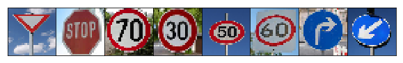

# Traffic Sign Recognition Classifier



---

## Overview
This project is part of the [Udacity's Self Driving Car Nanodegree](https://www.udacity.com/course/self-driving-car-engineer-nanodegree--nd013). 

A model will be designed, trained, and validated so it can classify traffic sign images using the [German Traffic Sign Dataset](http://benchmark.ini.rub.de/?section=gtsrb&subsection=dataset).

After training the model, it will be tried out on images of German traffic signs randomly selected on the web.

This project's source code can be found [here](https://github.com/miguelangel/sdc--traffic-sign-classifier).

---
## Goals/Steps

The goals/steps of this project are the following:

1. Load the data set from [here](https://s3-us-west-1.amazonaws.com/udacity-selfdrivingcar/traffic-signs-data.zip).
2. Explore, summarize and visualize the data set
3. Design, train and test a model architecture
4. Use the model to make predictions on new images
5. Analyze the softmax probabilities of the new images
6. Summarize the results with a written report


[//]: # (Image References)

[image1]: ./examples/visualization.jpg "Visualization"
[image2]: ./examples/grayscale.jpg "Grayscaling"
[image3]: ./examples/random_noise.jpg "Random Noise"
[image4]: ./examples/placeholder.png "Traffic Sign 1"
[image5]: ./examples/placeholder.png "Traffic Sign 2"
[image6]: ./examples/placeholder.png "Traffic Sign 3"
[image7]: ./examples/placeholder.png "Traffic Sign 4"
[image8]: ./examples/placeholder.png "Traffic Sign 5"

---

## Data Set Summary & Exploration

The German Traffic Sign Dataset is composed of 51839 images, belonging each one to 1 of 43 different categories. 


The dataset is split into training, validation and testing subsets:

| Subset     | # samples |
|------------|-----------|
| Training   |     34799 |
| Validation |      4410 |
| Testing    |     12630 |

The 43 image categories are labeled as follows:

| Label   | Sign name                                          | 
|---------|----------------------------------------------------| 
| 0       | Speed limit (20km/h)                               | 
| 1       | Speed limit (30km/h)                               | 
| 2       | Speed limit (50km/h)                               | 
| 3       | Speed limit (60km/h)                               | 
| 4       | Speed limit (70km/h)                               | 
| 5       | Speed limit (80km/h)                               | 
| 6       | End of speed limit (80km/h)                        | 
| 7       | Speed limit (100km/h)                              | 
| 8       | Speed limit (120km/h)                              | 
| 9       | No passing                                         | 
| 10      | No passing for vehicles over 3.5 metric tons       | 
| 11      | Right-of-way at the next intersection              | 
| 12      | Priority road                                      | 
| 13      | Yield                                              | 
| 14      | Stop                                               | 
| 15      | No vehicles                                        | 
| 16      | Vehicles over 3.5 metric tons prohibited           | 
| 17      | No entry                                           | 
| 18      | General caution                                    | 
| 19      | Dangerous curve to the left                        | 
| 20      | Dangerous curve to the right                       | 
| 21      | Double curve                                       | 
| 22      | Bumpy road                                         | 
| 23      | Slippery road                                      | 
| 24      | Road narrows on the right                          | 
| 25      | Road work                                          | 
| 26      | Traffic signals                                    | 
| 27      | Pedestrians                                        | 
| 28      | Children crossing                                  | 
| 29      | Bicycles crossing                                  | 
| 30      | Beware of ice/snow                                 | 
| 31      | Wild animals crossing                              | 
| 32      | End of all speed and passing limits                | 
| 33      | Turn right ahead                                   | 
| 34      | Turn left ahead                                    | 
| 35      | Ahead only                                         | 
| 36      | Go straight or right                               | 
| 37      | Go straight or left                                | 
| 38      | Keep right                                         | 
| 39      | Keep left                                          | 
| 40      | Roundabout mandatory                               | 
| 41      | End of no passing                                  | 
| 42      | End of no passing by vehicles over 3.5 metric tons | 


To obtain these metrics, the following code snippet has been used:

```python
import numpy as np

# Number of training examples
n_train = X_train.shape[0]

# Number of validation examples
n_valid = X_valid.shape[0]

# Number of testing examples.
n_test = X_test.shape[0]

# What's the shape of a traffic sign image?
image_shape = X_train.shape[1:]

# How many unique classes/labels there are in the dataset.
n_classes = np.unique(np.concatenate((y_train, y_valid, y_test))).shape[0]

print("Number of training examples =", n_train)
print("Number of validation examples =", n_valid)
print("Number of testing examples =", n_test)
print("Image data shape =", image_shape)
print("Number of classes =", n_classes)
```

In order to have a better idea about how our dataset is distributes, we have used used [scipy statistical functions](https://docs.scipy.org/doc/scipy/reference/stats.html) and [matplotlib.pyplot plotting framework](https://matplotlib.org/api/pyplot_api.html). 

In the pictures below, it can be observed that the training, validation and testing datasets have a similar _number of examples per label_ distribution, regardless of the _number of samples per label_ is not evenly distributed across each dataset.








To conclude with our dataset summary and exploration, I will show a small sample of the images. Each of these is a 32x32 with 3 color channels ([RGB](https://es.wikipedia.org/wiki/RGB)).



This _collage of images_ has been generated using the code snippet below:

```python
idx = np.random.randint(0, X_train.shape[0], size=36)
fig, axes = plt.subplots(6, 6, sharex=True, sharey=True, figsize=(5,5),)
for ii, ax in zip(idx, axes.flatten()):
    ax.imshow(X_train[ii], aspect='equal')
    ax.xaxis.set_visible(False)
    ax.yaxis.set_visible(False)
plt.subplots_adjust(wspace=0, hspace=0)
```


## Design and Test a Model Architecture

The LeNet-5 network will be used as a basis for this project's solution.

Nevertheless, several changes will be performed to make the network a bit more performant on this dataset.

### Pre-process the Data Set
The image data has been scaled so that the data values are between -1 and 1.

Standardizing either input or target variables tends to make the training process better behaved by improving the numerical condition ([ref.](ftp://ftp.sas.com/pub/neural/illcond/illcond.html)) of the optimization
problem and ensuring that various default values involved in initialization
and termination are appropriate. Standardizing targets can also affect the
objective function.

Please notice that _normalizing_ a vector most often means dividing by a norm of the vector, for example, to make the Euclidean length of the vector equal to one. In the NN literature, _normalizing_ also often refers to rescaling by the minimum
and range of the vector, to make all the elements lie between 0 and 1. In our case, we have chosen to scale between -1 and 1.

For further information, please have a look at [this link](http://www.faqs.org/faqs/ai-faq/neural-nets/part2/) at _Should I normalize/standardize/rescale the data?_ section.

Below it can be seen some sample images before and after scaling them. Please notice that these images do not reflect 100% with the scalation process performed to them. That is due to how [MatPlotLib](https://matplotlib.org/api/_as_gen/matplotlib.pyplot.imshow.html) works. It expects values in the range [0 .. 1] for floats or [0 .. 255] for integers. Out-of-range values are clipped to these bounds.

_Sample images before scaling them_:


_Sample images after scaling them_:


Other useful pre-processing techniques include [converting the images to grayscale](https://medium.com/@REInvestor/converting-color-images-to-grayscale-ab0120ea2c1e), [data augmentation](http://cs231n.stanford.edu/reports/2017/pdfs/300.pdf)...


### Model Architecture

My final model is based on the [LeNet](http://yann.lecun.com/exdb/lenet/) architecture:



Nevertheless, I have modified it to:
   - Accept RGB images of 32x32 instead of grayscale images of 28x28.
   - Classify 43 images instead of 10.
   - Increase its accuracy on this dataset.

In order to increase its accuracy, I have performed the following changes:
   - Use [Leaky_relu](https://www.tensorflow.org/api_docs/python/tf/nn/leaky_relu) activation function instead of [Relu](https://www.tensorflow.org/api_docs/python/tf/nn/relu).
   - Change the second [max_pool](https://www.tensorflow.org/api_docs/python/tf/nn/max_pool) layer by an [avg_pool](https://www.tensorflow.org/api_docs/python/tf/nn/avg_pool) layer.
   - Add [dropout](https://en.wikipedia.org/wiki/Dropout_(neural_networks)) of 0.8 in the last layers to reduce [overfitting](https://en.wikipedia.org/wiki/Overfitting).
   - Use 6 fully connected layers instead of 3.

This is my final model architecture:

| Layer         		|     Description	        					| 
|:---------------------:|:---------------------------------------------:| 
| Input         		| 32x32x3 RGB image   							| 
| Convolutional       	| Input: Input = 32x32x3. Output = 28x28x6. 	|
| Leaky_relu			|												|
| Max pooling	      	| 2x2 stride,  outputs 14x14x6   				|
| Convolutional    	    | Input: Input = 14x14x6. Output = 10x10x16.    |
| Leaky_relu		    |         									    |
| Avg pooling	      	| 2x2 stride, outputs 5x5x16 			    	|
| Flatten				| Input = 5x5x16. Output = 400.					|
| Fully connected	    | Input = 400. Output = 300. 					|	
| Leaky_relu		    |         									    |						
| Fully connected	    | Input = 300. Output = 200. 					|							
| Leaky_relu		    |         									    |						
| Fully connected	    | Input = 200. Output = 120. 					|
| Leaky_relu		    |         									    |						
| Fully connected	    | Input = 120. Output = 84. 					|
| Leaky_relu		    |         									    |						
| Dropout   		    | 0.8     									    |						
| Fully connected	    | Input = 84. Output = 60.   					|
| Leaky_relu		    |         									    |						
| Dropout   		    | 0.8     									    |						
| Fully connected	    | Input = 64. Output = 32.   					|
							


### Model training
During the training step, the [Adam optimizer](https://machinelearningmastery.com/adam-optimization-algorithm-for-deep-learning/) is used to try to minimize the [loss](https://en.wikipedia.org/wiki/Loss_function). Loss is calculated by reducing the mean of the [cross entropy](https://en.wikipedia.org/wiki/Cross_entropy) function, which uses the [Softmax function](https://en.wikipedia.org/wiki/Softmax_function) to predict the output between the different 43 categories.

The following hyperparameters have been tuned to improve the model accuracy:
* [learning rate](https://towardsdatascience.com/understanding-learning-rates-and-how-it-improves-performance-in-deep-learning-d0d4059c1c10)
* [epochs](http://www.fon.hum.uva.nl/praat/manual/epoch.html)
* [batch size](https://radiopaedia.org/articles/batch-size-machine-learning)

### Model results

My final model returned a 0.937 accuracy on the validation set, and a 0.933 accuracy on the testing set.

These were the steps I followed to get the results above:

* I first trained the _original_ LeNet architecture with a learning rate of 0.1, a batch size of 128 and a number of epochs of 10.
* Then I changed the activation function from Relu to Leaky_relu. I noticed that there was some improvement (around 0.15), so I decided to keep that activation function.
* Then I started playing different combinations of epochs, batch_size and learning rate.
  * I increased the epochs from 20 to 50, being 50 the best performant.
  * I decreased the learning rate from 0.1 to 0.001, trying 0.01, 0.005 and 0.002. 0.001 was the most performant in term of accuracy.
  *  Decreased the batch size from 128 to 64, which was the selected batch size because it was the most performant in terms of accuracy.
* With the changes above I obtained an increase of the accuracy of around 0.3.
* Then I started adding fully connected layers and dropout until getting the final solution.
* Please notice that the second max_pool layer from the original LeNet architecture has been replaced by an avg_pool layer. It does not increase significantly the accuracy (around 0.1), but it adds up. I also thought it was a beautiful change, so I decided to keep it.

When I decided to increase the number of fully connected layers, I was concerned to overfit the network. That's the reason why I added two dropout layers in the final steps.

### Test a Model on New Images


Here are eight German traffic signs that I found on the web:



Please notice that each of the images had a different size. They were rescaled programmatically when loaded.


Here are the results of the prediction:

| Image			            |     Prediction	        					                  | 
|:---------------------:|:---------------------------------------------------:| 
| Yield          		    | End of no passing by vehicles over 3.5 metric tons  | 
| Stop       			      | Stop   			                    						      	|
| Speed limit (70km/h)	| Turn left ahead						            	            |
| Speed limit (30km/h)	| Speed limit (30km/h)				            		      	|
| Speed limit (50km/h)	| Speed limit (30km/h)					                  		|
| Speed limit (60km/h)	| Speed limit (60km/h)					            	      	|
| Turn right ahead		  | Turn right ahead		 	        			                |
| Keep left     		    | Keep left                                           |


The model was able to correctly guess 5 of the 8 traffic signs, which gives an accuracy of 62.5%. 

### 5 Top softmax probabilities per prediction

The code for making predictions on my final model is located in the 17th cell of the IPython notebook.

Please find below the top 5 softmax predictions per image.

#### Sign 1: Yield.

| Probability         	|     Prediction	        					                  | 
|:---------------------:|:---------------------------------------------------:| 
| .998         			    | End of no passing by vehicles over 3.5 metric tons  | 
| .001     				      | Priority road 										                  |
| .0001				          | Vehicles over 3.5 metric tons prohibited						|
| ~0	      			      | No passing for vehicles over 3.5 metric tons        |
| ~0				            | End of speed limit (80km/h)      					          |

#### Sign 2: Stop.

| Probability         	|     Prediction	        					                  | 
|:---------------------:|:---------------------------------------------------:| 
| .999         			    | Stop                                                | 
| ~0	      			      | No passing for vehicles over 3.5 metric tons        |
| ~0			  	          | No vehicles                                         |
| ~0	      			      | Speed limit (80km/h)                                |
| ~0	      			      | Speed limit (60km/h)                                |

#### Sign 3: Speed limit (70km/h).

| Probability         	|     Prediction	        					                  | 
|:---------------------:|:---------------------------------------------------:| 
| .904         			    | Turn left ahead                                     | 
| .076	      			    | Speed limit (60km/h)                                |
| .01			  	          | Go straight or right                                |
| ~0	      			      | Keep right                                          |
| ~0	      			      | Ahead only                                          |

#### Sign 4: Speed limit (30km/h).

| Probability         	|     Prediction	        					                  | 
|:---------------------:|:---------------------------------------------------:| 
| ~1           			    | Speed limit (30km/h)                                | 
| ~0  	      			    | Speed limit (50km/h)                                |
| ~0  	      			    | Speed limit (70km/h)                                |
| ~0  	      			    | Speed limit (60km/h)                                |
| ~0			  	          | No vehicles                                         |

#### Sign 5: Speed limit (50km/h).

| Probability         	|     Prediction	        					                  | 
|:---------------------:|:---------------------------------------------------:| 
| ~1           			    | Speed limit (30km/h)                                | 
| ~0  	      			    | Speed limit (50km/h)                                |
| ~0  	      			    | Speed limit (100km/h)                               |
| ~0  	      			    | Stop                                                |
| ~0			  	          | No vehicles                                         |

#### Sign 6: Speed limit (60km/h).

| Probability         	|     Prediction	        					                  | 
|:---------------------:|:---------------------------------------------------:| 
| .998         			    | Speed limit (60km/h)                                | 
| .001  	        	    | Children crossing                                   |
| ~0  	      			    | Speed limit (50km/h)                                |
| ~0  	      			    | Speed limit (80km/h)                                |
| ~0			  	          | No passing                                          |

#### Sign 7: Turn right ahead.

| Probability         	|     Prediction	        					                  | 
|:---------------------:|:---------------------------------------------------:| 
| .999         			    | Turn right ahead                                    | 
| ~0  	      			    | Vehicles over 3.5 metric tons prohibited            |
| ~0  	      			    | Speed limit (80km/h)                                |
| ~0  	      			    | Speed limit (100km/h)                               |
| ~0			  	          | Road narrows on the right                           |

#### Sign 8: Keep left.

| Probability         	|     Prediction	        					                  | 
|:---------------------:|:---------------------------------------------------:| 
| .999         			    | Keep left                                           | 
| ~0  	      			    | Speed limit (120km/h)                               |
| ~0  	      			    | Turn right ahead                                    |
| ~0  	      			    | Wild animals crossing                               |
| ~0  	      			    | Speed limit (20km/h)                                |


I really hope you have enjoyed reading this project as much I have done writing it for you.

Miguel Ángel