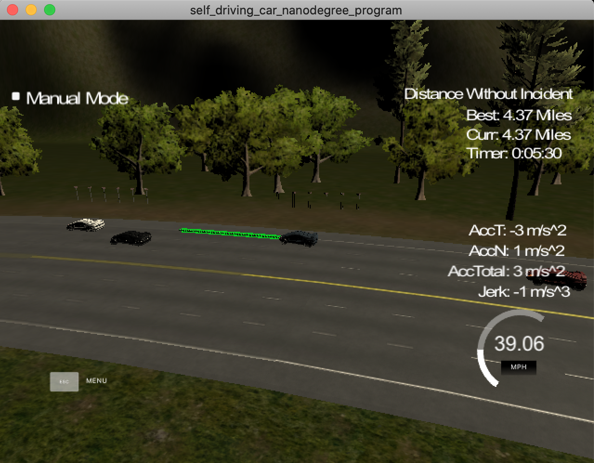

# Udacity's Self Driving Car Path Planning Project

## Solution walk-through.

### Please notice that this project is based on the content of the course, specifically in the Q&A video in lesson #6.

---

_Criteria 1: The code compiles correctly._

The code compiles without errors.

---
_Criteria 2: The car is able to drive at least 4.32 miles without incident._

I have performed several tests, and the ego-car is able to drive without incidents. Please, find an example below.

---
_Criteria 3: The car drives according to the speed limit._

The ego-car always tries to go a bit slower than 50 mph. It only decreases the speed when there is a car in the same lane at a distance of fewer than 30 meters.

---
_Criteria 4: Max Acceleration and Jerk are not Exceeded._

The car does not exceed a total acceleration of 10 m/s^2 and a jerk of 10 m/s^3.

I have used the `spline.h` library to create the car trajectory. It is handy to soften the changes and avoiding jerk.

The car increments its velocity by 0.224 mph, which makes the acceleration does not exceed 10 m/s^2.

---
_Criteria 5: Car does not have collisions._

To avoid collisions, the ego-car executes the following strategy:

1. The ego-car slows down its velocity when, in its same lane, there is a car ahead at a distance lower than 30 meters (`safe_distance` constant in the code).
2. Once the ego-car has detected that there is a car ahead at a distance lower than 30 meters, it evaluates sensed-data of the adjacents lanes. If there is no cars in an adjacent candidate lane, the ego-car changes to that line. As an alternative, if in an adjacent lane there is a gap of 30 meters ahead and/or behind the closest cars to the ego-car, it also performs a change. The security distance to perform a lane change is set in `safe_gap` constant.

---
_Criteria 6: The car stays in its lane, except for the time between changing lanes._

The ego-car behaves as requested. The `d` coordinate of the last point of the spline is either the middle of the current lane of the middle of the lane to which the ego-car is moving towards. 

---
_Criteria 7: The car is able to change lanes._

The ego-car changes lines following the rules described above (_Criteria 5_).

---
_Criteria 8: There is a reflection on how to generate paths._

In addition to the comments above, I have coded the following tricks to make the solution easier.

- When evaluating a lane change, the sensed-data of the current lane is not considered.
- It is used only the sensed-data of the adjacent lanes to the ego-car lane. For instance, if the car is in lane 0, the sensed-data of lane 2 is not considered.
- In order to decide if there is a safe gap to perform a lane change, the solution only uses the 's' position of the cars in the candidate lane which are behind/ahead of the 's' position of the ego-car.

---

I hope you have enjoyed reviewing this project as much as I have enjoyed coding it for you.

Miguel Martínez

